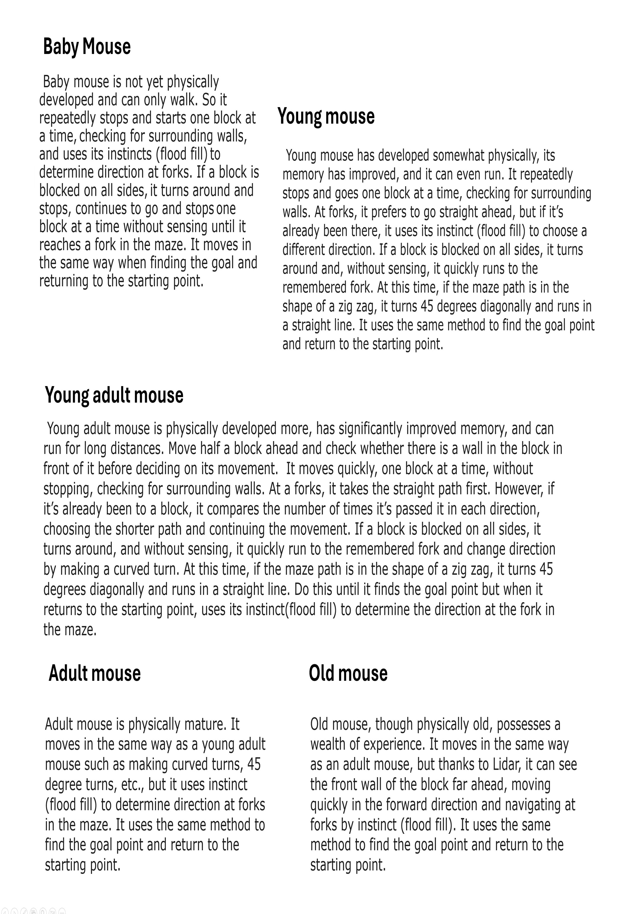
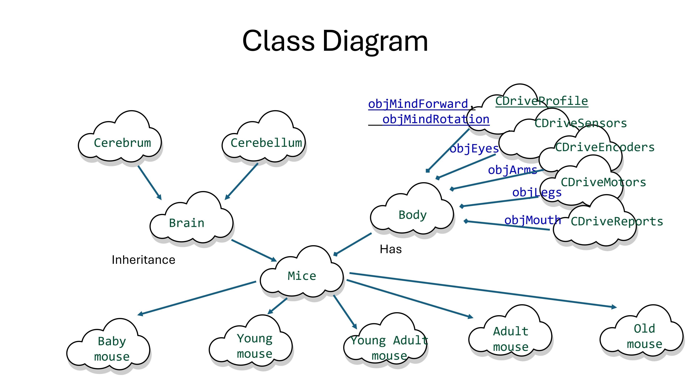
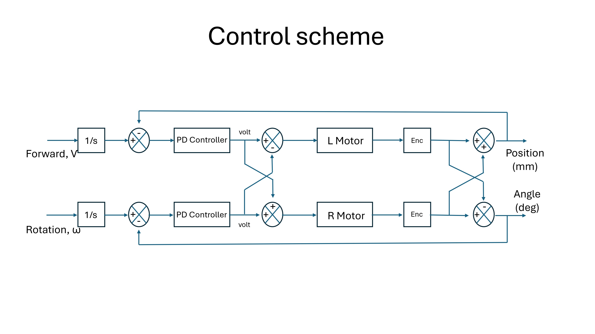

# Micromouse

## Introduction

Based on object-oriented theory, I redefined and systematized the Micro Mouse robot. Classes were defined, and inheritance was used to inherit characteristics from the systematized superclass. From children to elders, the robot could be modified to suit their needs, mimicking the natural behavior of an animal.

In this process, I applied the flood fill technique to capture the cerebrum instinct for direction selection, and for the cerebellum's movement, I controlled the motors with UV sensors and PIDs to mimic mouse movement. The flood fill logic was derived from the GitHub adam2392¡¯s source code, and the motor control logic was derived from the GitHub ukmars¡¯s source code, both modified to fit the intended purpose (Ref image   ).

After production, I had to check the maze search algorithm, and I was able to do so using the maze simulation on GitHub mms and maze files. 

## Mouses

## Acknowledgments

I would like to thank to Adam Li of adam2392, Peter Harrison of ukmars and Mack of mms for their contributions. 

## Introduction

I implemented the hardware using the STM32F411CEU6 Black Pill. The hardware design was created using Eagle CAD. 

## Software tools
STM32CubeIDE 1.19.0
QT Creator 17.0.2
Autodesk Eagle 9.6.2