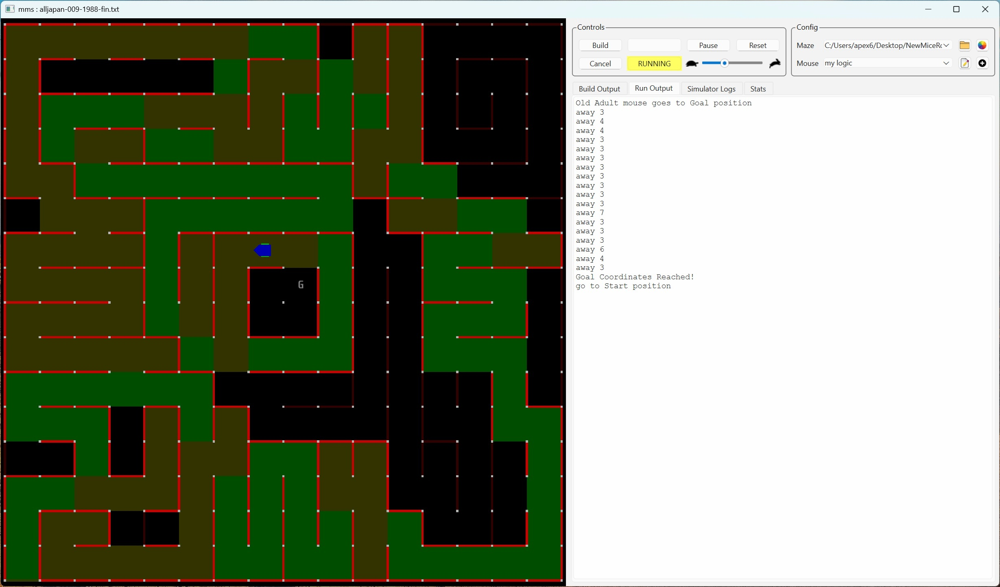
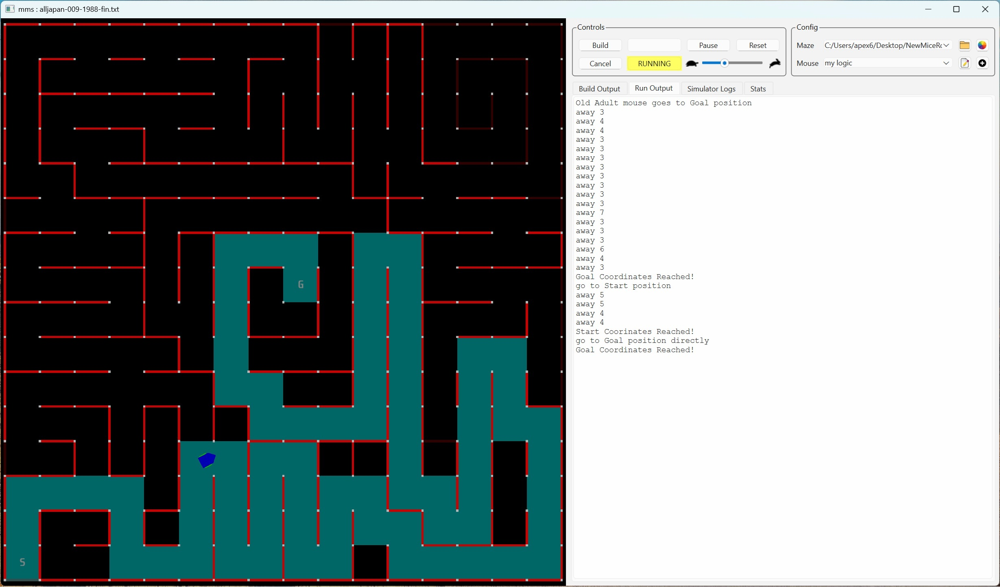
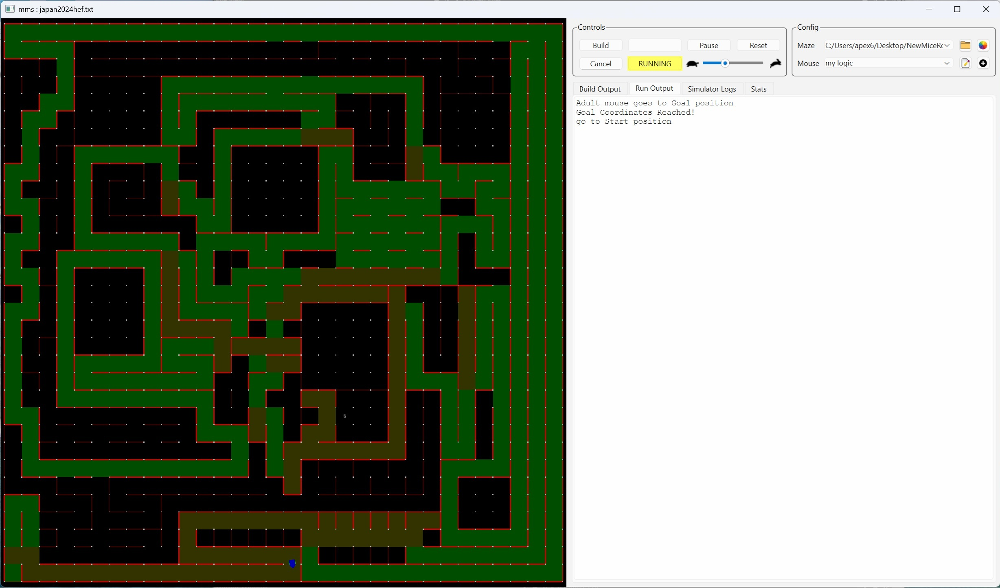
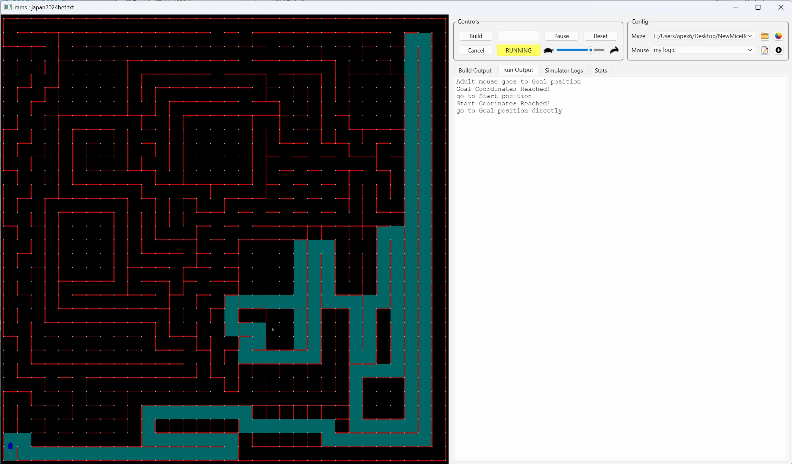
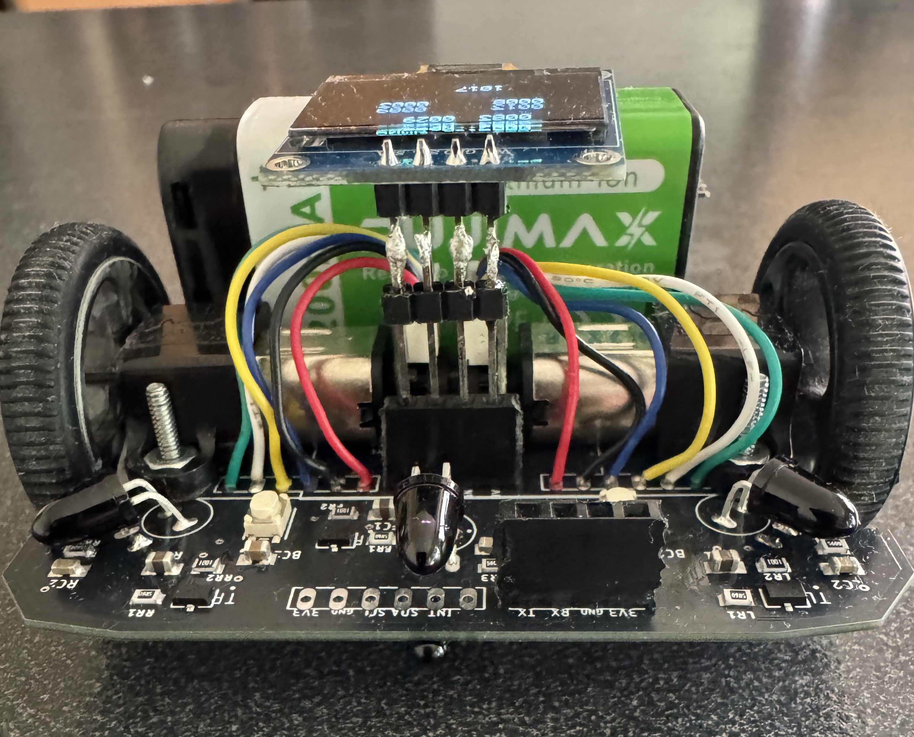
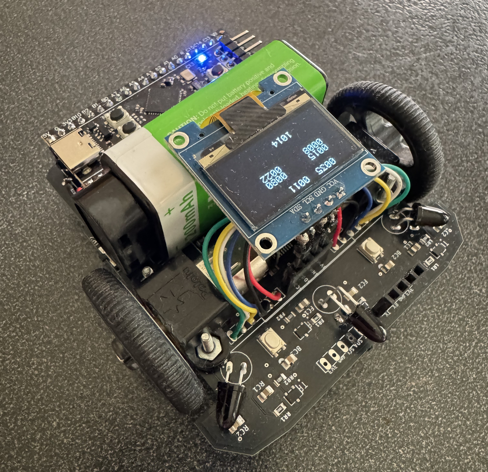
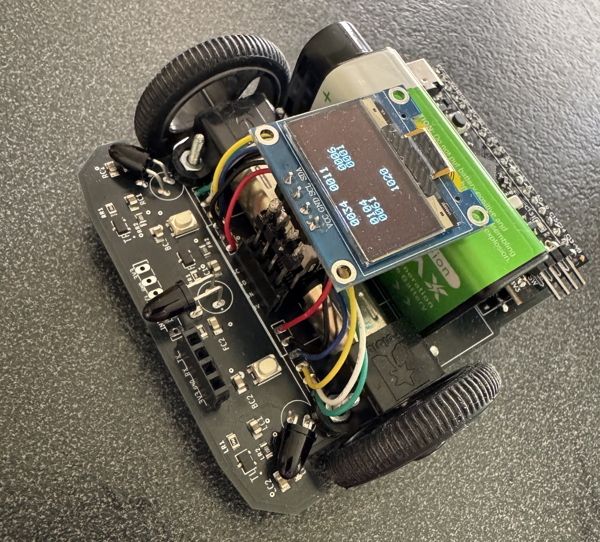
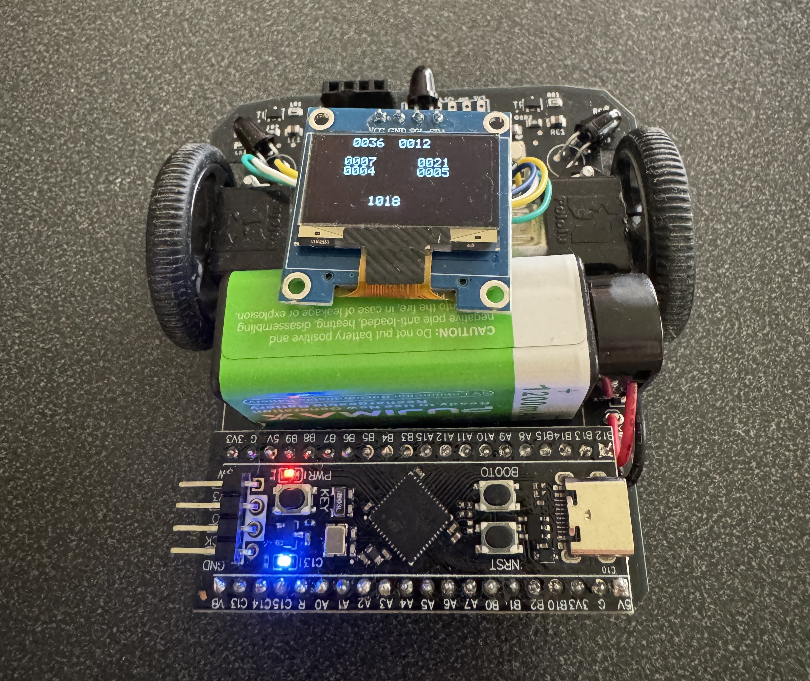

# Micromouse

## Introduction

Based on object-oriented theory, I redefined and systematized the Micro Mouse robot. Classes were defined, and inheritance was used to inherit characteristics from the systematized superclass. From children to elders, the robot could be modified to suit their needs, mimicking the natural behavior of an animal.

In this process, I applied the flood fill technique to capture the cerebrum instinct for direction selection, and for the cerebellum's movement, I controlled the motors with UV sensors and PIDs to mimic mouse movement. The flood fill logic was derived from the GitHub adam2392's source code, and the motor control logic was derived from the GitHub ukmars's source code, both modified to fit the intended purpose.

After production, I had to check the maze search algorithm, and I was able to do so using the maze simulation on GitHub mms and maze files. 
###  16x16 Classic size

###  32x32 Half size

## Mouses by generation

## Physical Mouse robot

I implemented the hardware using the STM32F411CEU6 Black Pill. The hardware design was created using Eagle CAD. 
Lidar sensor is option to measure a distace of front wall.

## Usage

* BodyConfig.h

This is where you set information related to the mouse body, such as the mouse size, wheel size, motor, sensor, encoder, etc.

| const float WHEEL_DIAMETER = 32.0f; // Adjust on test |
| const float ENCODER_PULSES = 12.0f; // DC Motor       |
| const float GEAR_RATIO     = 51.45f; //               |
| SensorCfg;|
| MotorCfg;|

* BrainConfig.h

This is where you set information related to the mouse's brain, such as the size of the maze, the location of the goal, etc. You can also choose whether or not to simulate.
 
| #define SIMULATION  1 // 0 or 1 - simulation or not |
||
| #define SIZE 16	// classic Size |
| #define GoalRight  SIZE/2  // center |
| #define GoalUpper  SIZE/2 |
||
|#define SIZE 32		// Half Size |
|#define GoalRight   20  // 2024 J |
|#define GoalUpper   9 |

* Buffers.h

This is where the size of the stack and queue is determined based on the size of the maze

| #define STACKSIZE 8192 |
| #define QUEUESIZE 512  |

* main.cpp

Generation-specific mice are pre-prepared and available for use upon request.

| Description |
|-|
| // Active mouse |
| //BabyMouse      *mice =  &BDavid; |
| //YoungMouse     *mice =  &YDavid; |
| AdultMouse     *mice =  &ADavid; |
| //OldMouse       *mice =  &ODavid; |
| //YoungAdultMouse  *mice =  &NDavid; |

## Software tools
| Tool | version | description |
|-|-|-|
| STM32CubeIDE | 1.19.0 | software |
| QT Creator | 17.0.2 | simulation |
| Autodesk Eagle | 9.6.2 | hardware |

## Acknowledgments

I would like to thank to Adam Li of adam2392, Peter Harrison of micromouseonline and Mack of mackorone for their contributions. 
